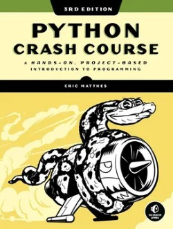

# Introduccion a la Logica de Programacion y Algoritmos con Python


## Descripcion

Bootcamp intensivo de Python disenado para estudiantes sin experiencia previa en programacion. Este programa forma parte del **Programa StudIA de la Alcaldia de Medellin**, enfocado en desarrollar habilidades fundamentales en logica de programacion, algoritmos y desarrollo web con Python.

## Instructor

**Miguel Angel Carrillo**
- GitHub: [@miguelcmo](https://github.com/miguelcmo)
- Ingeniero Electronico
- Especialista en Desarrollo de Software

## Objetivos del Bootcamp

- Comprender los fundamentos de la programacion y la logica computacional
- Dominar la sintaxis y estructuras de datos de Python
- Aplicar principios de Programacion Orientada a Objetos (POO)
- Desarrollar aplicaciones web funcionales con Flask
- Implementar proyectos completos desde el diseno hasta el deployment

## Estructura del Programa

### Informacion General
- **Duracion total:** 16 sesiones
- **Modalidad:** Hibrida (Virtual + Presencial)
- **Contenido:**
  - Fundamentos de Python (S00-S03)
  - Desarrollo Web Frontend (S05-S08)
  - Desarrollo Web Backend con Flask (S09-S13)
  - Proyecto Final y Deployment (S14-S15)

## Contenido del Repositorio

```
pythonBootcamp/
│
├── S00_classPresentations/         # Presentaciones en PDF de las sesiones
│
├── S01_variablesAndDataTypes/
│   ├── 01variables.py              # Variables y nomenclatura
│   ├── 02keywords.py               # Palabras reservadas de Python
│   ├── 03booleanValuesAndLogicOperators.py  # Operadores logicos
│   ├── 04functions.py              # Funciones basicas
│   └── 05userInput.py              # Entrada de usuario
│
├── S02_controlStructures/
│   ├── 01ifConditional.py          # Estructuras condicionales
│   ├── 02forLoop.py                # Bucle for
│   ├── 03rangeAndWhile.py          # Range y bucle while
│   └── x[1-5]codeChallenge.py      # Desafios de codigo
│
├── S03_listsAndDictionaries/
│   ├── 01lists.py                  # Listas y metodos
│   ├── 02dictionaries.py           # Diccionarios
│   ├── 03tuplesAndSets.py          # Tuplas y sets
│   └── x[1-5]codeChallenge.py      # Desafios de codigo
│
├── S05_htmlCssJs/                  # HTML, CSS y JavaScript basicos
│   └── index[1-5].html             # Ejemplos progresivos
│
├── S06_personalPageProject/        # Proyecto de pagina personal
│   └── htmlProject/                # Proyecto HTML/CSS
│
├── S07_adminPanelBootstrap/        # Panel de administracion con Bootstrap
│   └── inventoryManager/           # Sistema de gestion con Bootstrap
│
├── S08_adminPanelVanillaCSS/       # Panel de administracion con CSS puro
│   └── tasksManager/               # Sistema de gestion con Vanilla CSS
│
├── S09_introToFlask/               # Introduccion a Flask
│   └── app.py                      # Primera aplicacion Flask
│
├── S10_flaskTemplateRendering/     # Renderizado de templates
│   ├── basic/                      # Ejemplos basicos
│   └── intermediate/               # Ejemplos intermedios
│
├── S11_flaskTemplatesAndCss/       # Templates y CSS en Flask
│   ├── proficient/                 # Nivel avanzado
│   └── specialist/                 # Nivel especialista
│
├── S12_flaskAndSqlite/             # Flask con bases de datos SQLite
│   ├── sqlite/                     # Integracion SQLite
│   └── ultimate/                   # Proyecto completo
│
├── S13_sqlDatabases/               # Bases de datos SQL
│   ├── Chinook.db                  # Base de datos de ejemplo
│   └── queries.sql                 # Consultas SQL
│
├── S14_inventoryApp/               # Aplicacion de inventario completa
│   ├── app.py                      # Aplicacion principal
│   ├── api/                        # API REST
│   ├── static/                     # Archivos estaticos
│   ├── templates/                  # Templates HTML
│   └── README.md                   # Documentacion del proyecto
│
├── S15_pythonRoadmap/              # Roadmap de Python para desarrollo web
│   └── roadmap_python_web.md       # Guia completa de aprendizaje
│
└── bootcamp_python_programa_completo.md  # Programa detallado
```

## Programa por Fases

### Fase 1: Fundamentos de Python (Sesiones 0-3)

**Sesion 0 - Presentaciones**
- Presentaciones del instructor y estudiantes
- Introduccion al bootcamp
- Recursos y materiales

**Sesion 1 - Variables y Tipos de Datos**
- Variables y nomenclatura
- Palabras reservadas de Python
- Valores booleanos y operadores logicos
- Funciones basicas
- Entrada de usuario

**Sesion 2 - Estructuras de Control**
- Condicionales (if, elif, else)
- Bucle for
- Range y bucle while
- Desafios de codigo

**Sesion 3 - Estructuras de Datos**
- Listas y metodos
- Diccionarios
- Tuplas y sets
- Desafios de codigo

### Fase 2: Desarrollo Web Frontend (Sesiones 5-8)

**Sesion 5 - HTML, CSS y JavaScript**
- Fundamentos de HTML
- Estilos con CSS
- Introduccion a JavaScript
- Ejemplos progresivos

**Sesion 6 - Proyecto de Pagina Personal**
- Creacion de pagina personal
- Estructura HTML
- Estilos personalizados

**Sesion 7 - Panel de Administracion con Bootstrap**
- Framework Bootstrap
- Componentes y grid system
- Sistema de gestion de inventario
- Diseno responsivo

**Sesion 8 - Panel de Administracion con Vanilla CSS**
- CSS puro avanzado
- Flexbox y Grid
- Sistema de gestion de tareas
- Buenas practicas

### Fase 3: Desarrollo Web Backend (Sesiones 9-13)

**Sesion 9 - Introduccion a Flask**
- Fundamentos de Flask
- Routing basico
- Primera aplicacion web

**Sesion 10 - Flask Template Rendering**
- Motor de templates Jinja2
- Variables en templates
- Ejemplos basicos e intermedios

**Sesion 11 - Flask Templates y CSS**
- Integracion de CSS en Flask
- Templates avanzados
- Nivel profesional y especialista

**Sesion 12 - Flask y SQLite**
- Integracion de bases de datos
- CRUD con SQLite
- Proyecto completo

**Sesion 13 - Bases de Datos SQL**
- SQL avanzado
- Consultas complejas
- Base de datos Chinook

### Fase 4: Proyecto Final y Deployment (Sesiones 14-15)

**Sesion 14 - Aplicacion de Inventario Completa**
- Aplicacion web full-stack
- API REST
- Frontend y backend integrados
- Deployment en produccion

**Sesion 15 - Roadmap de Python**
- Roadmap completo de desarrollo web
- Mejores practicas
- Recursos adicionales
- Siguientes pasos en el aprendizaje

## Empezando

### Requisitos Previos

- **Python 3.11+** ([Descargar aqui](https://www.python.org/downloads/))
- **VS Code** ([Descargar aqui](https://code.visualstudio.com/)) o PyCharm
- **Git** ([Descargar aqui](https://git-scm.com/))
- Navegador web moderno (Chrome, Firefox)

### Instalacion

1. **Clonar el repositorio:**
   ```bash
   git clone https://github.com/miguelcmo/pythonBootcamp.git
   cd pythonBootcamp
   ```

2. **Crear entorno virtual:**
   ```bash
   python -m venv venv
   ```

3. **Activar entorno virtual:**
   - Windows:
     ```bash
     venv\Scripts\activate
     ```
   - macOS/Linux:
     ```bash
     source venv/bin/activate
     ```

4. **Instalar dependencias (para fases avanzadas):**
   ```bash
   pip install flask flask-sqlalchemy flask-wtf flask-migrate pytest python-dotenv
   ```

### Ejecutar los Ejemplos

```bash
# Navegar a la carpeta de la sesion
cd S01_variablesAndDataTypes

# Ejecutar un archivo Python
python 01variables.py
```

## Ejemplos de Uso

### Variables y Tipos de Datos
```python
# Declaracion de variables
nombre = "Miguel"
edad = 25
altura = 1.80
es_estudiante = True

# Imprimir variables
print(f"Hola, soy {nombre} y tengo {edad} anos")
```

### Listas
```python
# Crear y manipular listas
frutas = ['manzana', 'banana', 'cereza']
frutas.append('datil')
print(frutas)  # ['manzana', 'banana', 'cereza', 'datil']

# List comprehension
cuadrados = [x * x for x in range(6)]
print(cuadrados)  # [0, 1, 4, 9, 16, 25]
```

### Diccionarios
```python
# Crear diccionario
estudiante = {
    'nombre': 'Ana',
    'edad': 22,
    'carrera': 'Ingenieria'
}

# Acceder a valores
print(estudiante['nombre'])  # Ana
```

### Funciones
```python
# Definir funcion
def saludar(nombre):
    return f"Hola, {nombre}!"

# Llamar funcion
mensaje = saludar("Miguel")
print(mensaje)  # Hola, Miguel!
```

### Clases (POO)
```python
# Definir clase
class Estudiante:
    def __init__(self, nombre, edad):
        self.nombre = nombre
        self.edad = edad

    def presentarse(self):
        return f"Soy {self.nombre} y tengo {self.edad} anos"

# Crear objeto
estudiante = Estudiante("Ana", 22)
print(estudiante.presentarse())
```

## Desafios de Codigo

Cada sesion incluye desafios practicos para reforzar el aprendizaje. Los archivos de desafios estan marcados con `x[N]codeChallenge.py`.

### Ejemplo de Desafio
```python
# Desafio: Crear una funcion que calcule el factorial de un numero
def factorial(n):
    if n == 0 or n == 1:
        return 1
    return n * factorial(n - 1)

print(factorial(5))  # 120
```

## Proyectos Finales

Los estudiantes trabajaran en equipos para desarrollar uno de los siguientes proyectos:

### 1. Sistema de Gestion de Biblioteca
- CRUD de libros y usuarios
- Sistema de prestamos
- Dashboard con estadisticas

### 2. Aplicacion de Gestion de Tareas
- Tableros estilo Kanban
- Categorias y prioridades
- Multiples usuarios

### 3. Sistema de Reservas
- Calendario de disponibilidad
- Gestion de recursos
- Panel de administracion

### 4. Tienda Online Simple
- Catalogo de productos
- Carrito de compras
- Sistema de ordenes

### 5. Blog Personal
- CRUD de posts
- Sistema de comentarios
- Categorias y tags

## Tecnologias y Herramientas

- **Lenguaje:** Python 3.11+
- **Framework Web:** Flask
- **ORM:** SQLAlchemy
- **Testing:** pytest
- **Frontend:** HTML5, CSS3, Bootstrap
- **Control de Versiones:** Git & GitHub
- **Editor:** VS Code / PyCharm

## Recursos Adicionales

### Documentacion Oficial
- [Python Documentation](https://docs.python.org)
- [Flask Documentation](https://flask.palletsprojects.com)
- [SQLAlchemy Documentation](https://docs.sqlalchemy.org)

### Tutoriales Recomendados
- [Real Python](https://realpython.com) - Tutoriales y articulos
- [W3Schools Python](https://www.w3schools.com/python/) - Referencia rapida
- [Bootstrap Documentation](https://getbootstrap.com) - Framework CSS

### Libros

- "Python Crash Course" - Eric Matthes
[](S00_classPresentations/Eric_Matthes_Python_Crash_Course_A_Hands.pdf)

- "Flask Web Development" - Miguel Grinberg
[](S00_classPresentations\Flask_Web_Development_Developing.pdf)

- "Automate the Boring Stuff with Python" - Al Sweigart
[](S00_classPresentations\automatetheboringstuffwithpython_new.pdf)

## Contribuir

Las contribuciones son bienvenidas. Si encuentras algun error o tienes sugerencias:

1. Fork el proyecto
2. Crea una rama para tu feature (`git checkout -b feature/AmazingFeature`)
3. Commit tus cambios (`git commit -m 'Add some AmazingFeature'`)
4. Push a la rama (`git push origin feature/AmazingFeature`)
5. Abre un Pull Request

## Contacto

**Miguel Angel Carrillo**
- GitHub: [@miguelcmo](https://github.com/miguelcmo)
- Proyecto: [Python Bootcamp](https://github.com/miguelcmo/pythonBootcamp)

## Licencia

Este proyecto esta bajo la Licencia MIT - ver el archivo LICENSE para mas detalles.

## Agradecimientos

- **Programa StudIA - Alcaldia de Medellin** por el apoyo y la oportunidad de formar nuevos desarrolladores
- Todos los estudiantes que participan activamente en el bootcamp
- La comunidad de Python por sus excelentes recursos educativos

---

**Dale una estrella a este repositorio si te resulta util!**

**Listo para comenzar tu viaje en Python?**
- Revisa las presentaciones en [S00_classPresentations/](S00_classPresentations/)
- Empieza a programar con [S01_variablesAndDataTypes/01variables.py](S01_variablesAndDataTypes/01variables.py)
